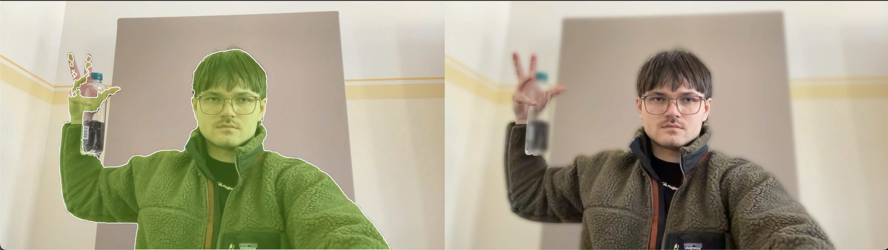

# Tehniline dokumentatsioon: Mesilaste närvivõrk ja objektituvastussüsteem

**Autor:** Kristo Palmik  
**GitHub:** [https://github.com/kkkkgit/mesilastenarvivork](https://github.com/kkkkgit/mesilastenarvivork)  
**Kuupäev:** Märts 2026  
**Õppeasutus:** TalTech Tartu Kolledž — Küber-füüsikalised süsteemid

---

## 1. Süsteemi ülevaade

Projekt koosneb kahest põhiosast:

1. **Mesilaste klassifitseerimise närvivõrk (BeeNet)** — konvolutsiooniline närvivõrk, mis treenitakse mesilaste, herilaste ja muude putukate piltidel ning klassifitseerib kaamerast tehtud pilte.
2. **Reaalajas objektituvastus ja segmenteerimine** — YOLOv8 ja SAM2 (Segment Anything Model 2) mudelite kombineerimine MacBooki kaameraga, võimaldades tuvastada objekte ja neid pikslitäpselt segmenteerida.

### Süsteemi arhitektuur

```
┌─────────────────────────────────────────────────┐
│                   Sisend                         │
│         MacBook Pro M1 kaamera (OpenCV)          │
└──────────────────────┬──────────────────────────┘
                       │
          ┌────────────┼────────────┐
          ▼            ▼            ▼
   ┌────────────┐ ┌──────────┐ ┌──────────────┐
   │   BeeNet   │ │ YOLOv8   │ │    SAM2      │
   │   (CNN)    │ │ (YOLO)   │ │ (Segment     │
   │            │ │          │ │  Anything)   │
   │ 3 klassi:  │ │ 80 klassi│ │ Pikslitäpne  │
   │ bee, wasp, │ │ objekti- │ │ segmentee-   │
   │ other      │ │ tuvastus │ │ rimine       │
   └─────┬──────┘ └────┬─────┘ └──────┬───────┘
         │              │              │
         ▼              └──────┬───────┘
   ┌───────────┐        ┌─────▼────────┐
   │ Klassi-   │        │ YOLO + SAM2  │
   │ fitseeri- │        │ kombineeritud│
   │ mine      │        │ pipeline     │
   └───────────┘        └──────────────┘
```

---

## 2. Kasutatud mudelid

### 2.1 BeeNet — kohandatud CNN

BeeNet on lihtne konvolutsiooniline närvivõrk, mis on loodud mesilaste klassifitseerimiseks.

**Arhitektuur:**

| Kiht | Tüüp | Parameetrid |
|------|-------|-------------|
| conv1 | Conv2d + ReLU + MaxPool | 1→32 kanalit, kernel 3×3, stride (2,1) |
| conv2 | Conv2d + ReLU + MaxPool | 32→16 kanalit, kernel 3×3, stride 1 |
| conv3 | Conv2d + ReLU + MaxPool | 16→16 kanalit, kernel 3×3, stride 1 |
| fc1 | Linear | 16×23×76 → 1000 |
| fc2 | Linear | 1000 → 100 |
| fc3 | Linear | 100 → 3 (bee, wasp, othr) |

**Treenimine:**
- Optimeerija: Adam (lr=0.001)
- Kaofunktsioon: CrossEntropyLoss
- Epohhid: 2 × 20 (tavaline + augmentatsiooniga)
- Andmestik: 27 pilti kolmes klassis (bee, wasp, othr)
- Seade: Apple M1 (MPS backend)

**Andmete augmentatsioon (teine treenimisvoor):**
- RandomRotation (20°)
- RandomResizedCrop (80–100% skaala)
- ColorJitter (heledus, kontrast, küllastus ±0.2)
- Grayscale teisendus

### 2.2 YOLOv8 — objektituvastus

YOLOv8 (You Only Look Once) on Ultralyticsi reaalajas objektituvastuse mudel.

- **Mudel:** yolov8n.pt (nano — kiire, ~6MB)
- **Treenitud:** COCO andmestikul (80 objektiklassi)
- **Väljund:** Bounding box'id koos klassi ja kindlusprotsendiga
- **Kasutus projektis:** Inimeste tuvastamine (klass 0 = "person"), mida edastatakse SAM2-le segmenteerimiseks

### 2.3 SAM2 — Segment Anything Model 2

Meta AI SAM2 on segmenteerimismudel, mis suudab mis tahes objekti pikslitäpselt välja lõigata.

- **Mudel:** sam2_t.pt (tiny — kiire reaalajas kasutuseks)
- **Sisend:** Punktipromptid (hiireklikkid) või bounding box'id (YOLOst)
- **Väljund:** Binaarsed maskid (pikslitäpne segmenteerimine)
- **Kasutus projektis:**
  - Interaktiivne segmenteerimine (kasutaja klikib objektile)
  - Automaatne inimeste segmenteerimine (YOLO annab box'id)
  - Tausta hägustamine (blur effect)

---

## 3. Failide kirjeldus

| Fail | Kirjeldus |
|------|-----------|
| `mesilaste_narvivork.py` | BeeNet mudeli treenimine, evalueerimine, andmete augmentatsioon ja mudeli salvestamine |
| `kaamera.py` | Treenitud BeeNeti kasutamine MacBooki kaameraga — pildista ja klassifitseeri |
| `yolo_kaamera.py` | YOLOv8 reaalajas objektituvastus kaameraga (80 klassi, bounding box'id) |
| `sam2_kaamera.py` | SAM2 interaktiivne segmenteerimine — kliki objektile hiire vasaku nupuga |
| `inimeste_segmenteerimine.py` | YOLO + SAM2 pipeline — automaatne inimeste tuvastus ja segmenteerimine, tausta hägustamine |

---

## 4. Näited süsteemi tööst

### 4.1 Inimeste segmenteerimine (YOLO + SAM2)



*Vasakul: YOLO tuvastab inimese ja SAM2 segmenteerib ta rohelise overlay'ga. Paremal: hägustatud taustaga tulemus — inimene on terav, taust on blur'itud.*

**Töövoog:**
1. YOLO tuvastab kaamerast inimesed (bounding box)
2. SAM2 saab box'id ja loob pikslitäpse maski
3. Mask rakendatakse kaadris — inimene jääb teravaks, taust hägustatakse GaussianBlur'iga

---

## 5. Tehnoloogiad ja sõltuvused

| Tehnoloogia | Versioon | Otstarve |
|-------------|----------|----------|
| Python | 3.12 | Programmeerimiskeel |
| PyTorch | 2.x | Närvivõrkude treenimine ja inferents |
| torchvision | 0.x | Pilditöötlus ja augmentatsioon |
| Ultralytics | 8.x | YOLOv8 ja SAM2 mudelid |
| OpenCV | 4.x | Kaamera ja pilditöötlus |
| matplotlib | 3.x | Graafikud ja visualiseerimine |
| Pillow | 10.x | Pilditöötlus |
| MPS (Metal) | — | Apple Silicon GPU kiirendus |

---

## 6. Paigaldamine ja käivitamine

```bash
# Klooni repositoorium
git clone https://github.com/kkkkgit/mesilastenarvivork.git
cd mesilastenarvivork

# Loo virtuaalkeskkond
python3 -m venv mesilased
source mesilased/bin/activate

# Paigalda sõltuvused
pip install torch torchvision matplotlib requests Pillow opencv-python ultralytics

# Treeni mudel
python3 mesilaste_narvivork.py

# Käivita kaamera (vali üks)
python3 kaamera.py                    # BeeNet klassifitseerimine
python3 yolo_kaamera.py               # YOLOv8 objektituvastus
python3 sam2_kaamera.py               # SAM2 interaktiivne segmenteerimine
python3 inimeste_segmenteerimine.py   # YOLO + SAM2 inimeste segmenteerimine
```

---

## 7. Süsteemi piirangud ja edasiarendused

**Piirangud:**
- BeeNet on treenitud väga väikese andmestikuga (27 pilti), mistõttu üldistusvõime on piiratud
- SAM2 segmenteerimine ei ole täielikult reaalajas — töötab kaader-kaadri haaval SPACE vajutamisega
- Tausta hägustamise kvaliteet sõltub SAM2 maski täpsusest servapiirkondades

**Võimalikud edasiarendused:**
- Suurema mudeli kasutamine (`yolov8s.pt`, `sam2_b.pt`) täpsema tulemuse jaoks
- Reaalajas video segmenteerimine (iga kaader automaatselt)
- Transfer learning (nt ResNet) BeeNeti asemel paremaks mesilaste klassifitseerimiseks
- Tausta asendamine suvalise pildiga (mitte ainult blur)

---

## 8. Autor

**Kristo Palmik**  
TalTech Tartu Kolledž — Küber-füüsikalised süsteemid  
GitHub: [https://github.com/kkkkgit/mesilastenarvivork](https://github.com/kkkkgit/mesilastenarvivork)